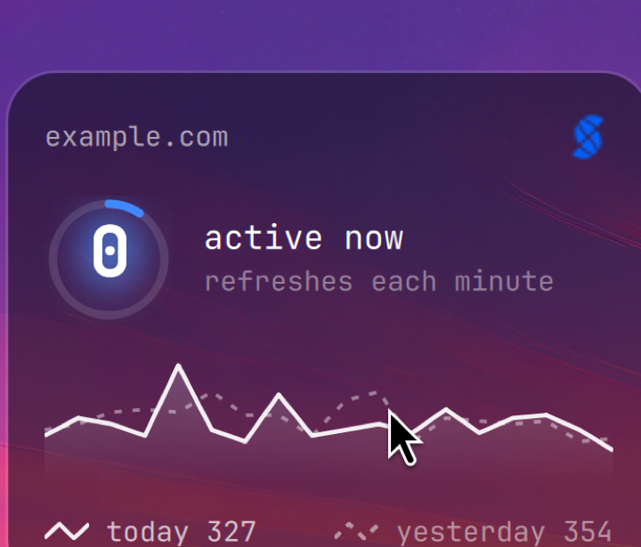
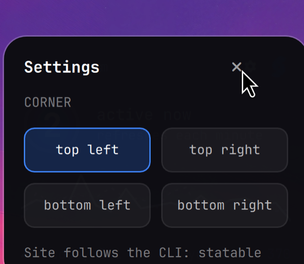

# Statable desktop card — an Omarchy widget

A macOS-style widget on the [Omarchy](https://omarchy.org) desktop: visitors on
your site right now, big, with a seven-day sparkline, pinned over the wallpaper.
It polls the [`statable`](https://github.com/key-arg/statable-cli) CLI, which
prints and exits, so the card holds no state and runs no daemon.



It sits on the layer above the wallpaper and below windows, so a window covers
it — as every desktop widget is covered. Glance at it on an empty desktop.

## Requires

- Omarchy with the Quickshell shell (the one with `~/.config/omarchy/shell.json`).
- The [`statable`](https://github.com/key-arg/statable-cli) CLI on `PATH`, signed
  in (`statable auth login`) with a default site (`statable sites use example.com`).

## Install

```bash
omarchy plugin add https://github.com/key-arg/omarchy-statable-desktop.git
```

It lands disabled. Read `Desktop.qml` (it is short), then enable it by adding its
id to the `plugins` array of `~/.config/omarchy/shell.json`:

```jsonc
{ "plugins": [ { "id": "com.statable.desktop" } ] }
```

The shell mounts it at startup (`keepLoaded`), pinned to the top-left corner.

## Moving it, and choosing the site

The card reads `~/.local/state/omarchy/settings/statable-desktop.json` (the
Omarchy plugin-settings location). Every key is optional:

```jsonc
{
  "corner":  "top-left",   // top-left | top-right | bottom-left | bottom-right
  "monitor": "",           // output name (e.g. "DP-1"); empty = wherever the shell puts it
  "margin":  28,           // gap from the screen edge, px
  "site":    ""            // domain or id to show; empty = the CLI's default site
}
```

A **position** change (`corner`, `monitor`, `margin`) applies on the next shell
reload — `omarchy-restart-shell`, or log out and in. Layer-shell surfaces are
anchored when they are created, so the card is placed on restart, not on save.

The **site** needs no setting: the card shows the Statable CLI's default site,
so `statable sites use example.com` moves the whole card — its name, its
seven-day numbers, and the dashboard it opens on click — to that site. Set
`site` only to pin the card to a site other than the CLI default.

## Behaviour

Only the logo is a click target — it opens the site's Statable dashboard.
Hovering the card reveals a small gear by the logo; clicking it opens a
settings panel on the card itself, with a corner picker that writes the
config for you. (A position change applies on the next shell reload.) The
chart responds to hover with a per-hour tooltip. The rest of the card is
inert, so it never steals a click meant for the window behind it.



The card fills in only from clean `statable` runs. No key, no default site, the
API unreachable, or the binary missing from `PATH` — each leaves that part blank
rather than showing a wrong or stale figure. Every call runs off the UI thread,
and the card refreshes once a minute.

Every call is bounded: 15 seconds and 64 KiB of output, after which the
process is killed and its output dropped. What does come back is checked
before it becomes the model — the count must be digits, each point of the
series a pair of finite numbers, the series at most 48 points, the site name
cut at 96 characters — and the dashboard link is assembled from a share hash
of the expected shape, never taken from the response as a URL. Every value
from the API is rendered as plain text.

The bar widget [`omarchy-statable`](https://github.com/key-arg/omarchy-statable)
is a separate plugin — a live pill with a click-through panel. Run either, or both.

## Remove

```bash
omarchy plugin remove com.statable.desktop
```

That deletes the plugin's folder under `~/.config/omarchy/plugins/` and its entry in `shell.json`. Nothing else is touched.

## Licence

MIT. Unsandboxed QML that runs inside `omarchy-shell`, like every Omarchy
plugin: read it before you enable it.
